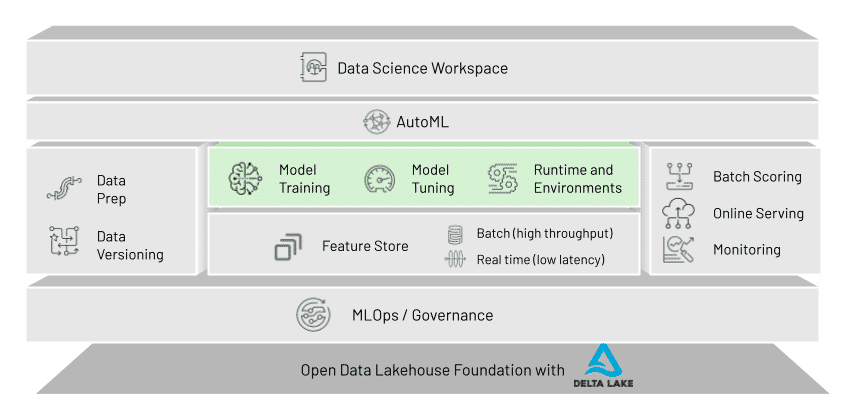

## Databricks ML
Sua proposta é oferecer em um somente local dados e códigos com Repos possibilitando criar workflows para  data scientists e machine learning engineers.

## **Model Registry**
Model Registry provides chronological model lineage (which MLflow experiment and MLflow run produced the model at a given time), model versioning, stage transitions (for example, from staging to production or archived), and email notifications of model events. You can also create and view model descriptions and leave comments.
São como os jobs só que tem as etapas se é staging ou prod

## **AutoMl** 
oferece um suporte a diversos frameworks de ml como pytorch skit learning

## **Feature Store**
É o repositório onde fica os arquivos ele pode trabalhar em
- batch com alta taxa de transferência
- stream baixa latência 
É onde os dados ficam antes de serem processados É um repositório centralizado onde é feito o processo de transformação para machine learning

