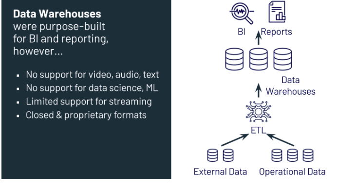
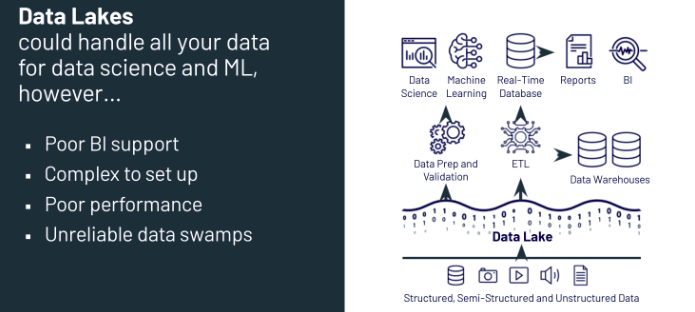
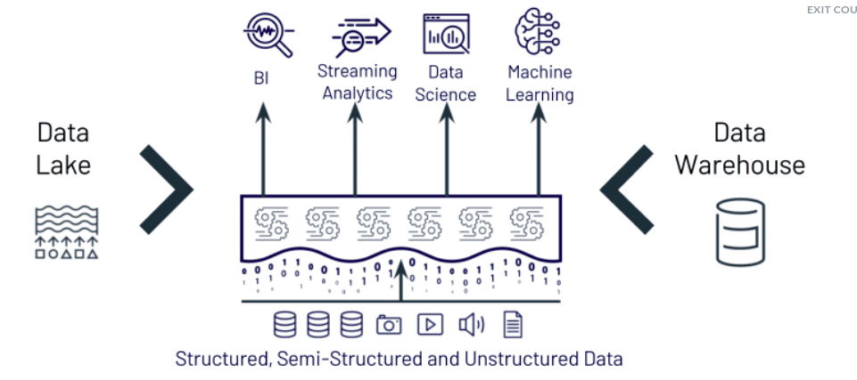
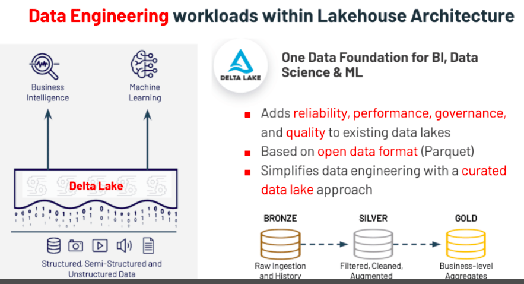

# Databricks Lakehouse Fundamentals 

## Diferenças entre Data lakes e data ware house

## Data warehouse
data warehouse basically work with etl work with data structured 

## Data lake
Trabalham com dados estruturados semi estruturados e não estruturados. Possui um custo mais baixo que warehouse, mas é muito fácil se transformar em um pântano (swamp) de dados. Sendo um desafio a questão da governança desses dados.

## Lake house
É uma evolução para atender as necessidades deixadas pelo ware house e data lake. Conseguindo lidar com diversos tipos de dados. Mas possui uma camada de governança mantendo schema e data quality.

Join idea data lake and data ware house
Data lakehouses have the following key features:

Transaction support to ensure that multiple parties can concurrently read or write data

Data schema enforcement to ensure data integrity (writes to a table are rejected if they do not match the table’s schema)

Governance and audit mechanisms to make sure you can see how data is being used

BI support so that BI tools can work directly on source data - this reduces data staleness.

Storage is decoupled from compute, which means that it is easier for your system to scale to more concurrent users and data sizes.

Openness - Storage formats used are open and standard. Plus, APIs and various other tools make it easy for team members to access data directly.

Support for all data types - structured, unstructured, semi-structured

End-to-end streaming so that real-time reporting and real-time data can be integrated into data analytics processes just as existing data is

Support for diverse workloads, including data engineering, data science, machine learning, and SQL analytics - all on the same data repository.

## Delta lake
Baseado em um formato aberto de arquivo o parquet o delta implementa controle de transação ACID. Ele foi pensado para a governança de dados.
